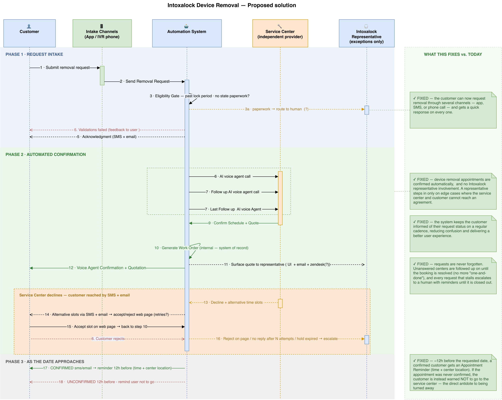
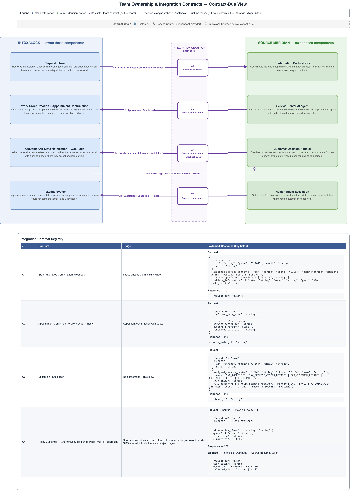
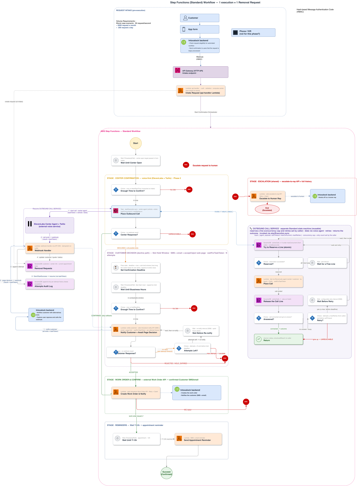

# Intoxalock Device-Removal Scheduling — Solution Architecture & System Behavior

*Prepared for Mindr (brand: Intoxalock) by Source Meridian · 2026-07-03 · Event-driven orchestration on AWS*

> **In one paragraph.** Today, scheduling a device removal is a manual, phone-based
> coordination task between an Intoxalock representative and an independent service
> center that has no availability data and no scheduling API. Requests are slow to
> confirm, silently dropped when a center doesn't answer, and routinely mistaken by
> customers for real appointments. The proposed solution replaces that manual
> coordination with a **single, long-running, event-driven workflow** on AWS: each
> removal request becomes one automated process that waits until the center is open,
> **calls the center with an AI voice agent** to confirm the appointment and capture the
> quote, calls the customer back only when a new time must be agreed, **issues a real
> work order**, confirms the customer, and **escalates to a human — with full history —
> only on true exceptions**. The result is an ambiguous, drop-prone request turned into a
> reliably-confirmed appointment backed by a valid work order.

This document explains the proposal from three complementary angles, each with its own
diagram:

1. **What the system does** — the end-to-end business flow a request travels through
   (Figure 1).
2. **Who owns what** — the split of responsibilities between Intoxalock and Source
   Meridian, and the exact API contracts on the seam between them (Figure 2).
3. **How it runs on AWS** — the technical architecture and runtime behavior (Figure 3).

---

## 1. The problem we are solving

The core problem is coordination with participants the current process cannot reliably
reach. Its root causes are:

| # | Root cause of today's pain |
|---|---|
| 1 | **No integration** with service centers — no API and no availability data to book against. |
| 2 | **Manual, phone-only coordination that doesn't retry** — a single unanswered call ends the attempt. |
| 3 | **No clear confirmation step** — customers treat a *request* as a booked *appointment*. |
| 4 | **No intake validation** — impractical times, closed centers, and ineligible requests enter the queue. |
| 5 | **Manual quote capture** — the removal price depends on the vehicle and is gathered by hand. |

Everything that follows is designed to remove these five causes directly.

---

## 2. What the system does — the end-to-end flow

Figure 1 shows the full journey of a single removal request across every participant:
the **Customer**, the **intake channels** (app / IVR), the **Automation System**, the
independent **Service Center**, and — only on exceptions — an **Intoxalock
Representative**. The right-hand column calls out, phase by phase, what each step fixes
versus today.

<figure style="margin:0.15in 0 0.05in 0; text-align:center; page-break-inside:avoid;">

<figcaption style="font-style:italic; color:#5B6573; font-size:9pt; margin-top:6px; text-align:center;">Figure 1 — Proposed solution, end-to-end business flow (three phases).</figcaption>
</figure>

**Phase 1 · Request Intake.** The customer submits a removal request through their
preferred channel (app or IVR phone). The Intoxalock backend checks the request is
eligible for automation — it is **past the lock period** and needs **no state paperwork**
— and immediately sends the customer an acknowledgment (SMS + email). Requests that need
paperwork are routed to a human; requests that fail validation get clear feedback. Only
clean, eligible requests move forward.

**Phase 2 · Automated Confirmation.** This is the heart of the system and runs with **no
representative involvement**:

- An **AI voice agent calls the service center** to confirm the appointment and capture
  the vehicle-based quote. If the center doesn't answer, the agent **follows up and
  retries** rather than giving up.
- On a clean **confirmation**, the system **generates the work order** (the internal
  system of record) and sends the customer a **voice-agent confirmation plus the
  quotation**. The quote is also surfaced to the representative for visibility.
- If the center **declines and offers alternative times**, the customer is reached by
  **SMS + email** with a link to an **accept/reject web page**. Accepting a new slot
  flows straight into the work-order step; rejecting, not replying after N attempts, or
  letting the hold expire **escalates** the request to a human.

**Phase 3 · As the date approaches.** A **confirmed** customer receives an appointment
reminder ~12 hours ahead with the time and center location. If a request was **never
confirmed**, the customer is instead warned **not to go** — the direct antidote to the
"showed up to a closed or unaware center" failure that happens today.

**What this fixes.** Requests are never forgotten (unanswered centers are followed up
until resolved), confirmation is unambiguous (it is tied to a real work order), the
customer is kept informed on a steady cadence, and a human only ever steps in on genuine
edge cases.

---

## 3. Who owns what — responsibilities and integration contracts

The system is delivered as a partnership. Figure 2 (the *Contract-Bus View*) draws a
clean line down the middle: **Intoxalock-owned** components on the left, **Source
Meridian-owned** components on the right, and the **integration seam** — the small set of
API contracts (C1–C4) that cross the boundary — in the center. Everything else is an
internal implementation detail of whichever side owns it.

<figure style="margin:0.15in 0 0.05in 0; text-align:center; page-break-before:always; page-break-inside:avoid;">

<figcaption style="font-style:italic; color:#5B6573; font-size:9pt; margin-top:6px; text-align:center;">Figure 2 — Team ownership and the four integration contracts on the seam.</figcaption>
</figure>

**Intoxalock owns** the systems of record and the customer touchpoints it already
operates: **Request Intake**, **Work Order Creation + Appointment Confirmation**, the
**Customer Alternative-Slots notification + web page**, and the **Ticketing System**
that a human uses to pick up escalations.

**Source Meridian owns** the automation brain: the **Confirmation Orchestrator** (the
long-running workflow that keeps every request on track), the **Service-Center AI agent**
(the voice assistant that calls centers), the **Customer Decision Handler** (which reaches
the customer for a decision on new times), and the **Human-Agent Escalation** step (which
assembles full history and hands off).

Only **four contracts** cross the seam. Keeping the interface this small is deliberate:
each side can evolve its internals freely as long as these four hold.

| Contract | Direction | When it fires | Key payload → response |
|---|---|---|---|
| **C1 · Start Automated Confirmation** | Intoxalock → Source | Intake passes the eligibility gate | `customer`, `assigned_service_center` (incl. timezone + hours), `customer_preferred_time_slots`, `vehicle_information`, `eligibility` → **202** `{ request_id }` |
| **C2 · Appointment Confirmed** | Source → Intoxalock | A time + quote are agreed | `request_id`, `confirmed_date_time`, `customer_id`, `service_center_id`, `quote`, `scheduled_time_slot` → **200** `{ work_order_id }` |
| **C3 · Escalation / Exception** | Source → Intoxalock | No agreement, or hold/TTL expiry | `request_id`, `customer`, `assigned_service_center`, `reason`, `last_state`, `full_history[]` → **200** `{ ticket_id }` |
| **C4 · Notify Customer (alt slots)** | Source → Intoxalock | Center declined and offered new times | `request_id`, `customer`, `alternative_slots`, `quote`, `task_token`, `expires_at` → **202**; the accept/reject page **webhooks back** `{ request_id, task_token, decision, selected_slot }` |

C4 is the one two-way contract: Source hands Intoxalock a `task_token`, Intoxalock hosts
the customer's accept/reject page, and the customer's decision is **webhooked back** to
resume the workflow exactly where it paused.

---

## 4. How it runs on AWS — architecture and system behavior

The Confirmation Orchestrator is implemented as a **single AWS Step Functions (Standard
Workflow)** state machine: **one execution per removal request**. Figure 3 is the full
technical architecture — intake edge, the state machine and its stages, the reusable
Outbound Call Service, and the data stores.

<figure style="margin:0.15in 0 0.05in 0; text-align:center; page-break-before:always; page-break-inside:avoid;">

<figcaption style="font-style:italic; color:#5B6573; font-size:9pt; margin-top:6px; text-align:center;">Figure 3 — AWS Step Functions architecture (one execution = one removal request).</figcaption>
</figure>

### 4.1 The workflow, stage by stage

**Pre-execution · Request Intake.** Before the workflow starts, the Intoxalock backend
posts the request to **API Gateway → `api-handler` Lambda**, which validates it, computes
the time-zone-aware **"center-open" target**, creates the **Removal Requests** record, and
starts the state machine. The workflow therefore only ever handles eligible, well-formed
requests and never has to reason about intake validation at runtime.

**Stage 1 · Wait Until Center Open.** A **Wait** state holds the execution — at **zero
compute cost** — until the center's working hours. Nothing is polling; the workflow simply
sleeps until it is actually useful to call.

**Stage 2 · Center Confirmation (voice-first).** A lead-time guard (*Enough Time to
Confirm?*) escalates if it is already too late to make the window. Otherwise the workflow
invokes the **Outbound Call Service** with the **center agent** and the vehicle/slot
payload; the agent confirms the appointment and captures the quote. On the result:
`CONFIRMED` → straight to the work order; `DECLINED + alternative slots` → customer
callback; `UNREACHABLE` after retries → escalate.

**Stage 3 · Customer Decision (decline path).** Used only when the center offered
different times. The workflow sets a **Slot-Hold deadline** (how long the center will hold
the new slots, capped at center close), re-checks the runway, then reaches the customer via
the Notify contract (C4) and **pauses** for the accept/reject page decision. `ACCEPTED` →
work order; `REJECTED / HOLD_EXPIRED / no reply after N attempts` → escalate.

**Stage 4 · Work Order & Confirm.** A single Lambda calls the **Intoxalock Work Order
API**, which creates the de-installation work order and notifies the customer (SMS +
email). This guarantees the customer only ever receives a confirmation that is **backed by
a real work order**.

**Stage 5 · Reminders.** *Wait Until T-12h* → *Send Appointment Reminder* → **Succeed
(Confirmed)** — the terminal happy path.

**Escalation (shared).** Any unrecoverable branch routes to one shared path: a single
Lambda calls the **escalate-to-rep API** with the **full attempt history** and ends in
**End (Escalated)**. Escalation is now the exception, not the default — and the human
starts with a complete record instead of from scratch.

### 4.2 Architecture components

| Component | Role |
|---|---|
| **Step Functions (Standard)** | The durable orchestrator. One execution per request; waits hours/days at no compute cost; native retries, catch, and full execution history. |
| **API Gateway + `api-handler` Lambda** | Intake edge: validate, compute the center-open target, create the request record, start the execution. |
| **Outbound Call Service** (nested state machine) | Encapsulates the whole "place a capacity-gated, retried voice call" primitive. Invoked by **both** the center and customer stages. |
| **ElevenLabs + Twilio** (2 voice agents) | External AI voice service — a **center agent** and a **customer agent**. Calls use `waitForTaskToken`; the call outcome resumes the workflow. |
| **Webhook Handler Lambda** | Receives the end-of-call webhook (idempotent on `callId`), resumes the paused call via `SendTaskSuccess`, updates state, and appends to the audit log. |
| **DynamoDB — Removal Requests** | Per-request customer/center info and current appointment state. |
| **DynamoDB — Attempts Audit Log** | Append-only per-attempt history; feeds escalation. |
| **DynamoDB — Call Capacity counter** | A distributed semaphore enforcing the **global 3-concurrent-call cap** across all executions and both call types. |
| **Intoxalock Work Order API / backend** | External system of record: creates work orders, notifies customers, handles human escalation. |
| **SSM Parameter Store** | Tunable knobs: concurrency cap, retry count/interval, slot-hold window. |

### 4.3 The reusable Outbound Call Service

Both the center call and the customer call need the exact same mechanics: reserve a line
under the global cap, dial, wait for the call to end, retry on no-answer, and release the
line (even on failure). Extracting this into **one child state machine** means that logic
— and the correctness of the shared **3-call semaphore** — is defined **once** and cannot
drift between the two call sites. Callers pass
`{ agent, payload, callTimeout, maxConcurrent, maxRetries }` and receive
`{ status, structuredResult }`.

---

## 5. Why an event-driven architecture is the right fit

The problem is defined by **waiting, external events, and unreliable participants** —
precisely what event-driven orchestration is built for.

| Root cause | How the event-driven design addresses it |
|---|---|
| **1. No integration** with service centers | The AI **voice agent is the integration**. The center is an external event source: we place a call, then **pause** until the call-end event arrives via webhook. No API on the center's side is required. |
| **2. Manual coordination that doesn't retry** | Retries are **native and declarative**. The Outbound Call Service loops (wait → re-dial) up to a configurable cap. "One-and-done" becomes "followed-up-until-resolved." |
| **3. No clear confirmation step** | Confirmation is a **modeled state transition**: the customer is notified as confirmed *only after* the Work Order API succeeds. |
| **4. No intake validation** | Validation and business-hours math happen **once, upstream** at intake; the workflow starts already-clean and simply waits for the right moment to act. |
| **5. Manual quote capture** | The quote is captured **in-band** by the voice agent during the same confirmation call and stored as **informational** data — never blocking the booking. |

**Why Step Functions specifically.** A request may wait hours for a center to open or for a
customer callback; Step Functions **suspends with no running compute** and resumes on an
event — no idle poller to pay for or operate. Executions safely live for the days a booking
can take, surviving restarts and deploys with no custom state persistence. The
`waitForTaskToken` pattern — "place a call → something happens in the real world → a
webhook tells us the result" — fits the domain exactly. Declarative **Retry/Catch** and a
complete **visual execution history** replace bespoke retry loops and ad-hoc logging, and
that history is what makes each escalation informative. Finally, **observability is the
diagram**: operators can see exactly where any request is — waiting on the center, waiting
on the customer, or escalated.

---

## 6. Key design decisions

1. **One state machine, stages as visual groups** — ~40 states, well within limits; avoids
   the operational overhead of many small machines.
2. **One deliberate exception — the Outbound Call Service is a nested machine** — so the
   shared-semaphore call primitive is defined once and reused by both call sites.
3. **Global 3-call cap via a DynamoDB semaphore** — the voice-service concurrency limit is a
   single shared pool; enforced in one place with reserve/release (released even on Catch,
   so a crash never leaks a line).
4. **Quote is informational, never a gate** — the customer confirms a *date*, not a *price*.
5. **Everything tunable lives in SSM** — concurrency cap, retry count/interval, slot-hold
   window — adjustable without a redeploy.
6. **Escalation is shared and history-rich** — a single terminal path, fed by every failure
   branch, that hands humans a complete record.

---

## 7. Assumptions & open items

- **Voice platform (ElevenLabs + Twilio):** must carry the `taskToken` into the call and
  echo it back on the webhook, return **structured post-call data** (confirmed / declined,
  slots, quote), and report **call status** (no-answer / busy / voicemail). The real
  **concurrency tier** needs to be confirmed.
- **Compliance:** AI-disclosure and call-recording rules for automated outbound calls vary
  by state and need a short compliance spike.
- **Intoxalock API contracts** (Work Order API and escalate-to-rep API — idempotency and
  error semantics) to be confirmed against contracts C2 and C3.
- **Volume:** designed for ~5,000 requests/month (~200/day) with headroom; the 3-call cap is
  the primary throughput constraint and is configurable.
- **Out of scope (by intake filter):** requests requiring state paperwork are handled
  outside this automated flow.
